# Copilot Persistent Memory System

> A production-grade, file-based memory and multi-agent framework for GitHub Copilot. Survives every IDE restart. Zero external dependencies.

---

## The Problem

GitHub Copilot loses all context every time your IDE restarts. Every conversation starts from scratch. You re-explain your architecture, your conventions, your decisions — over and over.

This system solves that permanently.

---

## Architecture

<div align="center">

<p align="center">
  
</p>

<p>
  <i>
    Production-grade persistent memory and multi-agent orchestration for GitHub Copilot
  </i>
</p>

</div>

## How It Works

GitHub Copilot automatically reads `.github/copilot-instructions.md` at the start of every session. This file bootstraps a full agent and memory system by instructing Copilot to load a set of Markdown files before doing anything else. Those files contain your project's persistent memory — architecture decisions, coding conventions, known issues, session history — and a fleet of specialized agents that fire automatically for every task.

**When your IDE restarts, Copilot reads the memory files and picks up exactly where it left off.**

---

## Architecture

```
your-project/
│
├── .github/
│   └── copilot-instructions.md          ← Copilot auto-loads this. THE entry point.
│
├── .copilot-agents/
│   ├── orchestrator.md                  ← Master agent. Routes tasks, fires sub-agents.
│   │
│   ├── agents/
│   │   ├── cloud-migration-agent.md     ← AWS → Azure Lambda migration
│   │   ├── java-migration-agent.md      ← Java 8 ↔ Java 21 migration
│   │   ├── spring-agent.md              ← Spring Boot + Spring AI specialist
│   │   ├── backend-agent.md             ← General-purpose backend development
│   │   │
│   │   └── sub-agents/
│   │       ├── dependency-analyzer.md   ← Scans and upgrades dependencies
│   │       ├── test-writer.md           ← Writes tests for all generated code
│   │       ├── security-auditor.md      ← Audits auth, secrets, input handling
│   │       ├── api-designer.md          ← Generates OpenAPI specs
│   │       ├── db-optimizer.md          ← Reviews queries and schema
│   │       └── code-reviewer.md         ← Final review pass on all output
│   │
│   └── memory/
│       ├── project-context.md           ← What this project is
│       ├── architecture.md              ← System design
│       ├── conventions.md               ← Coding rules and patterns
│       ├── decisions.md                 ← Architecture Decision Record (ADR log)
│       ├── known-issues.md              ← Active bugs and tech debt
│       ├── session-log.md               ← Rolling task history
│       └── agent-state.md               ← Resume state after restarts
```

---

## Boot Sequence

Every session, before responding to anything, Copilot executes this sequence:

```
1. Read orchestrator.md
2. Read memory/project-context.md
3. Read memory/architecture.md
4. Read memory/conventions.md
5. Read memory/decisions.md
6. Read memory/known-issues.md
7. Read memory/session-log.md
8. Read memory/agent-state.md

→ "Memory restored. [Project name] loaded. Ready."
```

---

## Primary Agents

### Cloud Migration Agent
**File:** `agents/cloud-migration-agent.md`  
**Triggers on:** Any AWS → Azure migration task

Before writing a single line of code, it asks a mandatory 30-question pre-flight checklist covering:
- Which AWS services are in scope (Lambda, S3, DynamoDB, SQS, SNS, API Gateway, RDS)
- Lambda runtimes, triggers, layers, and cold start tolerances
- VPC, IAM, and secrets configuration
- Data migration scope
- CI/CD pipeline and IaC tooling (CloudFormation, Terraform, CDK)
- SLA, compliance, and cutover strategy

Then generates: service mapping, IaC translation (CloudFormation → Bicep/Terraform), handler code conversion, and a cutover plan.

**AWS → Azure conversion table (built in):**

| AWS | Azure |
|---|---|
| Lambda | Azure Functions |
| API Gateway | Azure API Management |
| S3 | Blob Storage |
| DynamoDB | Cosmos DB |
| SQS | Service Bus |
| Secrets Manager | Key Vault |
| Cognito | Azure AD B2C / Entra |
| CloudWatch | Azure Monitor / App Insights |
| EventBridge | Azure Event Grid |

---

### Java Migration Agent
**File:** `agents/java-migration-agent.md`  
**Triggers on:** Any Java version upgrade or downgrade

Pre-flight checklist covers:
- Source and target Java versions
- Single vs multi-module project structure
- Spring Boot, Hibernate, and Jakarta EE versions
- Known pain points: `sun.*` APIs, `javax` → `jakarta`, reflection, `SecurityManager`, `finalize()`, Nashorn, JAXB
- JVM flags in use (`--add-opens`, GC flags, etc.)
- Docker base image versions

Built-in migration tables for Java 8 → Java 21 covering Virtual Threads, Records, Sealed Classes, Pattern Matching, Text Blocks, Switch Expressions, and the `javax` → `jakarta` namespace change.

For **downgrades (Java 21 → Java 8)**: generates a compatibility report and requires explicit confirmation before proceeding — this is a lossy operation.

Every migration produces: compatibility report, dependency upgrade list, before/after code diffs, build file changes, JVM flag updates, and a test validation plan.

---

### Spring Agent
**File:** `agents/spring-agent.md`  
**Triggers on:** Spring Boot, Spring AI, Spring Cloud, Spring Security, Spring Data tasks

Covers:
- **Spring Boot 3.x** — auto-configuration, `@ConfigurationProperties`, constructor injection (enforced)
- **Spring AI** — all providers: OpenAI, Anthropic Claude, Azure OpenAI, Google Gemini, Ollama, Mistral, Hugging Face
- Chat Client patterns, Structured Output, RAG with Vector Stores, Tool Calling, Custom Advisors
- **Spring Security** — stateless JWT, OAuth2 Resource Server, RBAC
- **Spring Data** — Specifications, Projections, `@Transactional` at service layer
- **Spring Cloud** — Gateway (not Zuul), Resilience4j (not Hystrix), Micrometer tracing

---

### Backend Agent
**File:** `agents/backend-agent.md`  
**Triggers on:** General backend development — APIs, databases, messaging, infrastructure

Standards enforced:
- REST API design: versioned paths, consistent response envelope, idempotency keys, rate limit headers, correlation IDs
- Database: no `SELECT *`, always paginate, parameterized queries, EXPLAIN ANALYZE before shipping, `id/created_at/updated_at/deleted_at` on all tables
- Observability: structured JSON logs with traceId/spanId, p50/p95/p99 latency metrics, distributed tracing, `/actuator/health`
- Security: all endpoints authenticated by default, input validation at controller, no hardcoded secrets, OWASP dependency scanning in CI
- Performance: right-layer caching, async for I/O, no N+1 queries, timeouts on all external calls

---

## Sub-Agents (Auto-Fired)

Sub-agents fire automatically in sequence after every primary agent activates. **You never need to trigger them manually.**

### Execution order

```
1. Dependency Analyzer   ← always first
2. Security Auditor      ← checks scope for vulnerabilities
3. API Designer          ← if any interface is being created/changed
4. DB Optimizer          ← if any database layer is touched
5. Test Writer           ← always, for everything touched
6. Code Reviewer         ← always last
```

### Dependency Analyzer
Scans `pom.xml`, `build.gradle`, `package.json`, `requirements.txt`, or `go.mod`. Reports incompatible dependencies (must change), outdated dependencies (recommend upgrade), and CVE risks (must patch). For cloud migrations, maps AWS SDK dependencies to their Azure equivalents.

### Security Auditor
Checks JWT validation, role/permission enforcement, input sanitization (SQL injection, XSS, path traversal), secret handling (no hardcoded credentials, no secrets in logs), and cloud-specific concerns (least-privilege IAM, no wildcard permissions, encryption at rest/in transit).

Output severity levels: `CRITICAL` (block deployment) / `HIGH` (fix before merge) / `MEDIUM` (next sprint) / `LOW`.

### API Designer
Produces full OpenAPI 3.0 YAML specs for new endpoints. Enforces: versioning in path, nouns not verbs, consistent response envelope, RFC 9457 Problem Details for errors, ISO 8601 dates. Flags breaking changes vs the existing contract.

### DB Optimizer
Reports missing indexes, N+1 query patterns in JPA/Hibernate, `SELECT *` usage, unpaginated large result sets, and generates ready-to-run Flyway/Liquibase migration files for any schema changes.

### Test Writer
Generates complete, ready-to-run test files (no placeholders) using JUnit 5, Mockito, AssertJ, Testcontainers, and MockMvc. Covers: unit tests, integration tests, API tests, and migration regression tests. Minimum 3 test cases per public method.

### Code Reviewer
Final pass on all generated code. Checks correctness, convention compliance, idiom compliance, readability, error handling completeness, logging quality, and dead code. Produces `MUST FIX` / `SHOULD FIX` / `SUGGESTION` verdict.

---

## Memory System

### Files

| File | Purpose | Updated When |
|---|---|---|
| `project-context.md` | Project name, stack, team, integrations | Rarely — stable facts |
| `architecture.md` | System design, components, data flow | When architecture changes |
| `conventions.md` | Coding style, naming, patterns | When new patterns are established |
| `decisions.md` | ADR log — what was decided and why | After every architectural decision |
| `known-issues.md` | Active bugs, workarounds, tech debt | When bugs are found or resolved |
| `session-log.md` | Rolling task history (last 30 entries) | After every completed task |
| `agent-state.md` | Resume state for IDE restarts | When sessions grow long |

### Memory write-back

Copilot writes to memory files automatically at these moments:

- **New architectural decision made** → `decisions.md`
- **New pattern or convention established** → `conventions.md`
- **Bug found or resolved** → `known-issues.md`
- **Task completed** → `session-log.md`
- **Session growing long / context large** → `agent-state.md`

### Session log format

```
## [YYYY-MM-DD HH:MM] — <one line summary>
- Agent: <primary agent used>
- Sub-Agents Fired: <list>
- Task: <what was done>
- Outcome: <result or status>
- Next: <what comes next>
```

---

## Setup

### 1. Download and extract

Download the ZIP and extract it. You will get a `copilot-memory-system/` folder containing `.github/` and `.copilot-agents/`.

### 2. Copy into your project root

```bash
cp -r copilot-memory-system/.github /path/to/your/project/
cp -r copilot-memory-system/.copilot-agents /path/to/your/project/
```

Or if you are setting up a new project:

```bash
mv copilot-memory-system your-project
cd your-project
git init
```

### 3. Fill in the memory files

Open these files and fill in your project details:

```
.copilot-agents/memory/project-context.md   ← project name, stack, team
.copilot-agents/memory/architecture.md      ← system design
.copilot-agents/memory/conventions.md       ← coding rules already in use
```

The more detail you provide here, the better Copilot performs from session one.

### 4. Commit everything

```bash
git add .github/ .copilot-agents/
git commit -m "feat: add copilot persistent memory system"
```

### 5. Open your IDE

Next time Copilot activates, it will read the boot sequence and confirm:

```
Memory restored. [Your project name] loaded. Ready.
```

---

## Commands

Type these at any point in a Copilot conversation:

| Command | Effect |
|---|---|
| `!memory` | Print a full summary of all loaded memory |
| `!agent cloud` | Switch to Cloud Migration Agent explicitly |
| `!agent java` | Switch to Java Migration Agent explicitly |
| `!agent spring` | Switch to Spring Agent explicitly |
| `!agent backend` | Switch to Backend Agent explicitly |
| `!log` | Append current task to session-log.md |
| `!state` | Print current agent-state.md |

---

## Context Compression

When a session is running long and context is filling up, Copilot will automatically:

1. Summarize the current task → `session-log.md`
2. Write new patterns → `conventions.md`
3. Write new decisions → `decisions.md`
4. Snapshot current progress → `agent-state.md`
5. Notify you: *"Context saved. Safe to restart your IDE."*

After restart, the boot sequence restores everything.

---

## Global Rules (always active)

- Never violates `memory/conventions.md`
- Never re-asks a decision already in `memory/decisions.md`
- Always checks `memory/known-issues.md` before touching related code
- Always fires sub-agents automatically — no manual activation needed
- Always cites memory when relevant: *"Per the decision logged on [date]..."*
- Always shows which agents were fired for full transparency

---

## Requirements

- GitHub Copilot (any plan with chat support)
- VS Code, JetBrains IDEs, or any IDE with Copilot integration that supports `copilot-instructions.md`
- No additional dependencies, APIs, databases, or services required

---

## Contributing

All agent files are plain Markdown. To add a new agent:

1. Create `agents/your-agent.md` following the pattern of existing agents
2. Add it to the registry table in `.github/copilot-instructions.md`
3. Add routing logic to `orchestrator.md`
4. Commit and push

Memory files are written by Copilot during normal use — treat them as living documents, not config files.

---

## License

MIT — use freely in personal and commercial projects.
